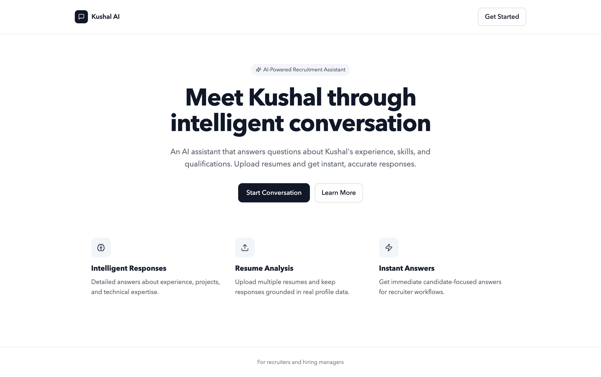
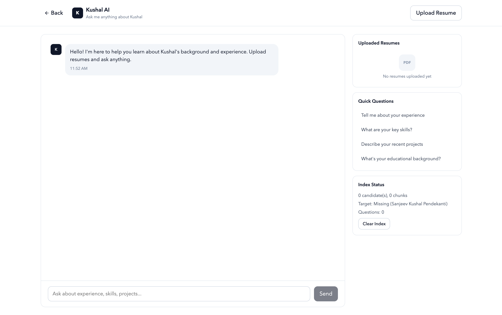
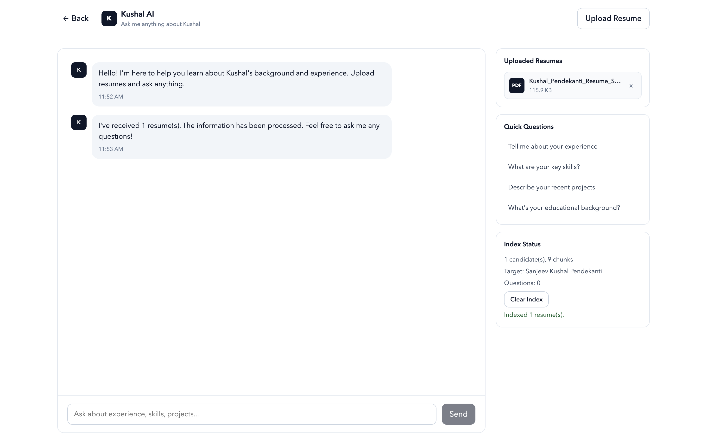
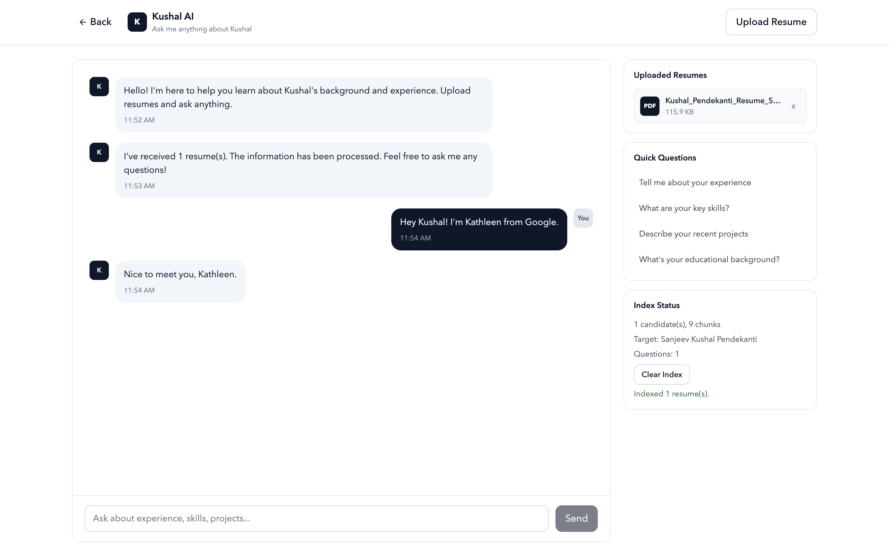
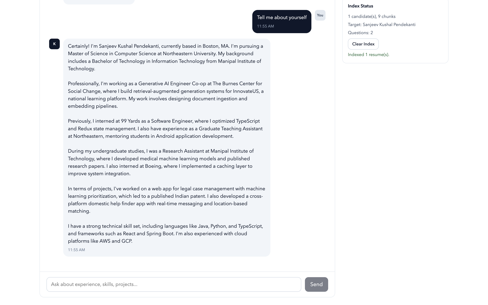

# Kushal AI

Kushal AI is a full-stack recruiter chat assistant with:

- TypeScript frontend (`frontend/`) built with React + Vite
- Python backend (`backend/`) built with FastAPI

The chatbot is locked to answer as:

- **Sanjeev Kushal Pendekanti**

You can upload multiple resumes for indexing, but recruiter chat is fixed to Sanjeev's profile.  
If Sanjeev's resume is not indexed, the API returns:

- `Sanjeev Kushal's resume is not uploaded please upload.`

## Architecture

- Frontend calls backend APIs for status, indexing, and chat.
- Backend (`backend/app/main.py`) exposes REST endpoints and delegates core logic to `LegacyRuntime`.
- `LegacyRuntime` executes the RAG/agent pipeline from `app.py` core functions (without Streamlit UI rendering).
- Resume chunks are embedded and stored in Chroma (`DATA_DIR`).
- Recruiter-context memory is persisted to `DATA_DIR/agent_memory.json`.

## Core Features

- Multi-resume PDF upload and indexing.
- Resume metadata extraction + semantic chunking.
- Recruiter-style agent responses in first person as Sanjeev.
- Tooling:
- `semantic_search` for grounded resume retrieval.
- `web_search` for weather queries.
- `github_search` for GitHub profile/repo lookups constrained by resume-discovered handles.
- Structured memory for recruiter context:
- recruiter name
- recruiter company
- follow-up day/time/timezone
- Query guardrails + response safety checks.

## API Endpoints

Backend base URL is typically `http://localhost:8000`.

- `GET /health`
- `GET /api/status`
- `POST /api/index/build` (multipart `files`)
- `POST /api/index/clear`
- `POST /api/chat` with JSON `{ "query": "..." }`

## Screenshots

### Landing Page


### Initial Chat


### Resume Upload


### Recruiter Intro


### Tell Me About Yourself


## Tech Stack

- Frontend: React, TypeScript, Vite, lucide-react
- Backend: FastAPI, Uvicorn, Pydantic
- LLM/Embeddings: OpenAI API
- Vector DB: ChromaDB
- PDF parsing: `pdfplumber`, `PyPDF2`
- External tools: Tavily (weather), GitHub API

## Local Development

### 1. Backend

```bash
cd backend
python -m venv .venv
source .venv/bin/activate
pip install -r requirements.txt
cp .env.example .env
uvicorn app.main:app --reload --host 0.0.0.0 --port 8000
```

Set at minimum in `backend/.env`:

```env
OPENAI_API_KEY=your_openai_key
```

Optional backend env vars include `TAVILY_API_KEY`, `GITHUB_TOKEN`, `DATA_DIR`, `CORS_ORIGINS`, model overrides, and memory limits (see `backend/.env.example`).

### 2. Frontend

```bash
cd frontend
npm install
cp .env.example .env
npm run dev
```

Default frontend env:

```env
VITE_API_BASE_URL=http://localhost:8000
```

Open `http://localhost:5173`.

## Deployment (Render)

`render.yaml` defines:

- `resumeai-backend` (FastAPI web service)
- `resumeai-frontend` (static site)

Deploy via Render Blueprint, then set secrets like `OPENAI_API_KEY` (and optionally Tavily/GitHub keys) on backend.

## Repository Layout

- `frontend/`: React + TypeScript client
- `backend/`: FastAPI server and runtime wrapper
- `backend/app/legacy_runtime.py`: bridge that runs `app.py` core logic in API mode
- `app.py`: legacy core pipeline used by runtime bridge
- `screenshots/`: UI images
- `render.yaml`: Render deployment blueprint

## Notes

- PDF-only upload is supported.
- Per-file upload size limits are enforced by backend guardrails.
- The backend is the source of truth for target-person lock and recruiter-memory behavior.
