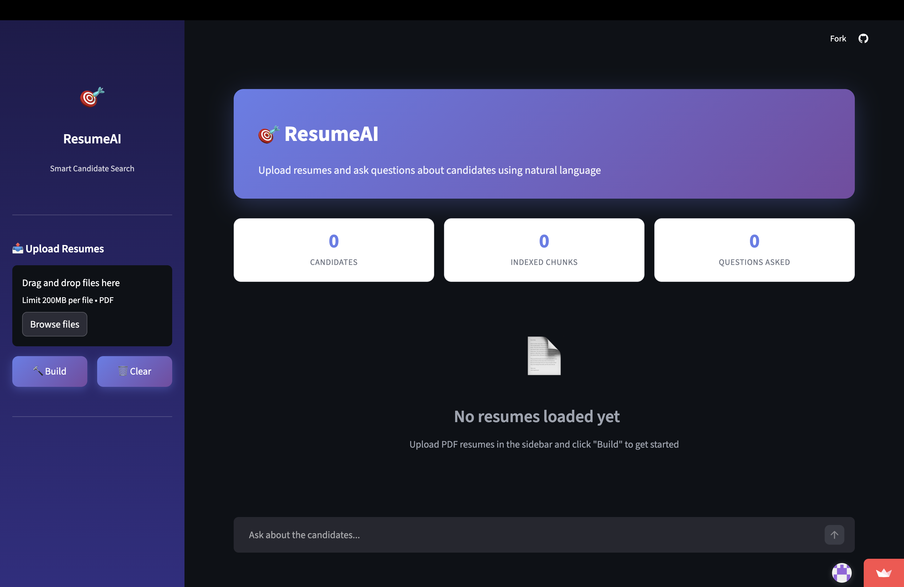
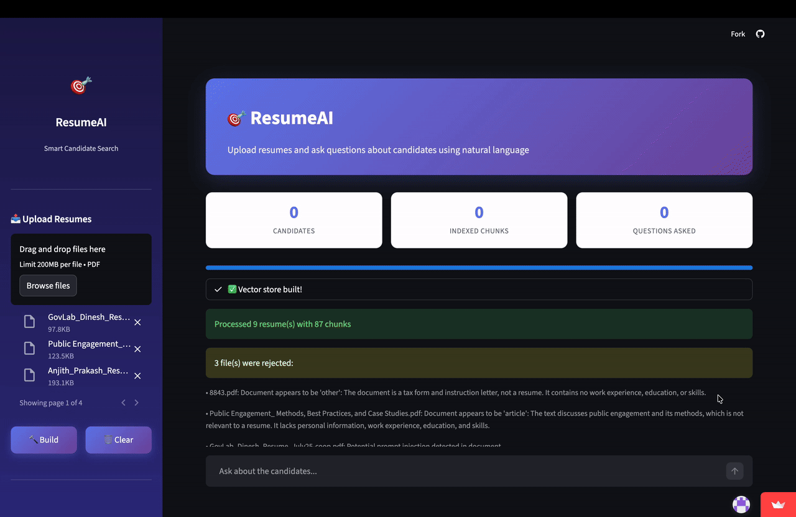

# 🎯 ResumeAI - Smart Candidate Search

A RAG (Retrieval-Augmented Generation) powered chatbot that enables natural language queries over multiple candidate resumes. Upload PDF resumes and ask questions about candidates using conversational AI.

[](https://resume-rag-kushal.streamlit.app/)

## 🚀 Live Demo

**[Try ResumeAI →](https://resume-rag-kushal.streamlit.app/)**

---

## 📸 Screenshots

### Empty State

*Clean interface prompting users to upload resumes and get started*

### Loaded Candidates

*Demo*

---

## 🛠️ Tech Stack

| Technology | Purpose |
|------------|---------|
| **Python 3.8+** | Core programming language |
| **Streamlit** | Web application framework & UI |
| **OpenAI API** | Embeddings (`text-embedding-3-small`) and chat completions (`gpt-4o`, `gpt-4o-mini`) |
| **ChromaDB** | In-memory vector database for semantic search |
| **pdfplumber** | Primary PDF text extraction (complex layouts) |
| **PyPDF2** | Fallback PDF text extraction |
| **python-dotenv** | Environment variable management |

---

## ✨ Features

### Core Functionality
- **📄 Multi-Resume Upload** — Drag and drop PDF resumes (max 2MB each)
- **🔍 Semantic Search** — Find candidates based on skills, experience, and qualifications using vector similarity
- **💬 Natural Language Queries** — Ask questions like "Who has Python experience?" or "Compare candidates with ML background"
- **🧠 Conversation Context** — Maintains context across questions with pronoun resolution ("What about his education?")
- **📊 Real-time Metrics** — Track candidates, indexed chunks, and questions asked

### Advanced RAG Pipeline
- **LLM-based Metadata Extraction** — Automatically extracts name, skills, experience, companies, and education from resumes
- **Semantic Chunking** — Intelligently splits resumes by sections (experience, skills, education, projects)
- **Temporal Query Expansion** — Handles date-based queries ("What was John doing in December 2024?")
- **Query Rewriting** — Resolves pronouns and contextual references using conversation history
- **Multi-candidate Queries** — Supports comparison queries across all loaded candidates

### Security & Guardrails
- **File Validation** — Size limits, PDF magic byte verification
- **Prompt Injection Detection** — Blocks malicious content in uploaded documents
- **Query Guardrails** — Validates query relevance and blocks injection attempts
- **Response Safety** — Filters sensitive information from generated responses
- **Content Sanitization** — Removes suspicious Unicode and formatting

---

## 📦 Installation

### Prerequisites

- Python 3.8+
- OpenAI API key

### Local Setup

1. **Clone the repository**
   ```bash
   git clone https://github.com/yourusername/personalized_RAG_chatbot.git

   cd personalized_RAG_chatbot
   ```

2. **Create a virtual environment**
   ```bash
   python -m venv venv
   source venv/bin/activate  # On Windows: venv\Scripts\activate
   ```

3. **Install dependencies**
   ```bash
   pip install -r requirements.txt
   ```

4. **Set up environment variables**
   
   Create a `.env` file in the root directory:
   ```env
   OPENAI_API_KEY=your_openai_api_key_here
   ```

5. **Run the application**
   ```bash
   streamlit run app.py
   ```

6. **Open in browser**
   
   Navigate to `http://localhost:8501`

---


## 📁 Project Structure

```
resumeai/
├── app.py                 # Main Streamlit application
├── requirements.txt       # Python dependencies
├── .env                   # Environment variables (local only, not committed)
├── .gitignore             # Git ignore file
├── README.md              # Documentation
└── screenshots/           # Application screenshots
    ├── empty-state.png
    └── demo.gif
```

---

## 🔧 Configuration

### Environment Variables

| Variable | Description | Required |
|----------|-------------|----------|
| `OPENAI_API_KEY` | Your OpenAI API key for embeddings and chat | Yes |

### Model Configuration

The application uses the following OpenAI models (configurable in `app.py`):

| Constant | Model | Purpose |
|----------|-------|---------|
| `EMBED_MODEL` | `text-embedding-3-small` | Document and query embeddings |
| `CHAT_MODEL` | `gpt-4o-mini` | Query rewriting, temporal expansion |
| `ANSWER_MODEL` | `gpt-4o` | Final answer generation |
| `EXTRACTION_MODEL` | `gpt-4o-mini` | Resume metadata extraction |
| `GUARDRAIL_MODEL` | `gpt-4o-mini` | Content validation |

### Other Settings

| Constant | Default | Description |
|----------|---------|-------------|
| `MAX_FILE_SIZE_MB` | 2 | Maximum file size per resume |
| `MAX_CONTEXT_TURNS` | 5 | Conversation turns to maintain |
| `COLLECTION_NAME` | `resumes` | ChromaDB collection name |

---

## 📝 Usage

1. **Upload Resumes** — Use the sidebar to drag & drop or browse for PDF resumes 
2. **Build Index** — Click the "Build" button to process and index the resumes
3. **Ask Questions** — Type natural language queries in the chat input
4. **Review Sources** — Expand the "Sources" section to see which resume chunks were used

### Example Queries

**Single Candidate**
- "Tell me about John's experience"
- "What skills does Sarah have?"

**Temporal Queries**
- "What was John doing in December 2024?"
- "Where did Sarah work in 2023?"

**Multi-Candidate**
- "Who has experience with machine learning?"
- "Compare candidates with Python skills"
- "List all candidates with cloud experience"

**Follow-up Questions**
- "What about his education?" (resolves pronoun from context)

---

## 🏗️ Architecture

```
┌─────────────────┐     ┌──────────────────┐     ┌─────────────────┐
│   PDF Upload    │────▶│   Guardrails     │────▶│  Text Extract   │
│   (Streamlit)   │     │  (File + Content)│     │ (pdfplumber/    │
└─────────────────┘     └──────────────────┘     │  PyPDF2)        │
                                                  └────────┬────────┘
                                                           │
                        ┌──────────────────┐               ▼
                        │   LLM Metadata   │◀──────────────┤
                        │   Extraction     │               │
                        │   (gpt-4o-mini)  │               │
                        └────────┬─────────┘               │
                                 │                         │
                                 ▼                         ▼
                        ┌──────────────────┐     ┌─────────────────┐
                        │ Semantic Chunking│     │   Sanitization  │
                        │ (by section type)│     └─────────────────┘
                        └────────┬─────────┘
                                 │
                                 ▼
                        ┌──────────────────┐
                        │    ChromaDB      │
                        │ (Vector Store)   │
                        └────────┬─────────┘
                                 │
┌─────────────────┐              │
│   User Query    │──────────────┤
└────────┬────────┘              │
         │                       │
         ▼                       │
┌──────────────────┐             │
│ Query Rewriting  │             │
│ + Temporal       │             │
│   Expansion      │             │
└────────┬─────────┘             │
         │                       │
         ▼                       ▼
┌──────────────────┐     ┌─────────────────┐
│ Semantic Search  │◀────│   Embeddings    │
│ (with filters)   │     │ (text-embed-3)  │
└────────┬─────────┘     └─────────────────┘
         │
         ▼
┌──────────────────┐
│ Answer Generation│
│    (gpt-4o)      │
└────────┬─────────┘
         │
         ▼
┌──────────────────┐
│ Response Safety  │
│   Check          │
└────────┬─────────┘
         │
         ▼
    [ Response ]
```

---

## 🤝 Contributing

Contributions are welcome! Please feel free to submit a Pull Request.

1. Fork the repository
2. Create your feature branch (`git checkout -b feature/AmazingFeature`)
3. Commit your changes (`git commit -m 'Add some AmazingFeature'`)
4. Push to the branch (`git push origin feature/AmazingFeature`)
5. Open a Pull Request

---

## 📄 License

This project is licensed under the MIT License - see the [LICENSE](LICENSE) file for details.

---

## 🙏 Acknowledgments

- [Streamlit](https://streamlit.io/) for the web framework
- [OpenAI](https://openai.com/) for embedding and language models
- [ChromaDB](https://www.trychroma.com/) for vector storage

---

<p align="center">
  Made with ❤️ by Kushal
</p>